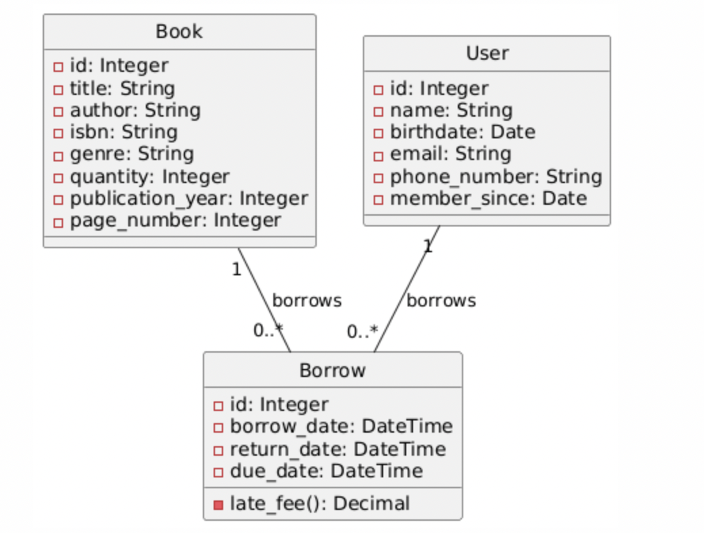

# UML Diagram for Library Management System

Below is the UML diagram representing the structure and relationships of the Library Management System.

---

## Diagram

---
## Minor Changes
* page_number
* member_since
* return_date

are not used, therefore deleted from the database