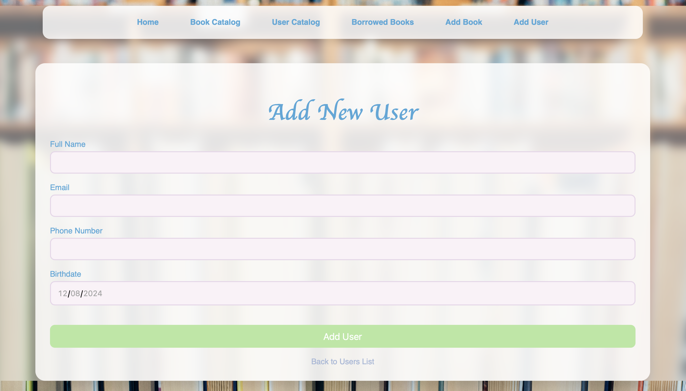

# Library Management System

The Library Management System is a web-based application that helps manage books, users, and borrow records efficiently.
The application includes features such as a searchable book catalog, user management, and borrowing functions.

---

## Screenshots

### 1. Home Page


### 2. Book Catalog with Filter


### 3. User List with Filter


### 4. Borrowed Books


### 5. Add New User



### 6. Edit User


---

## Features

1. **Book Management**
    - Add, edit, delete books.
    - View all books in a paginated catalog.
    - Filter books by title, author, genre, or publication year.

2. **User Management**
    - Add, edit, delete users.
    - View all users with filtering by name, email, or ID.

3. **Borrowing Management**
    - Borrow a book for a user.
    - Return borrowed books and update availability.
    - Calculate late fees based on overdue returns.

4. **UI Highlights**
    - Fully responsive design with intuitive layouts.
    - Styled forms and buttons for a seamless experience.

---

## Installation

1. Clone the repository:
   ```bash
   git clone https://github.com/yourusername/library-management.git
   cd library-management

2. Create and activate the virtual environment:
   ```bash
   python -m venv venv
   source venv/bin/activate  # On Windows: venv\Scripts\activate

3. Install dependencies:
   ```bash
   pip install -r requirements.txt
   
4. Initialize database:
   ```bash
   flask db init
   flask db migrate
   flask db upgrade
   
5. Run app:
   ```bash
   flask run
   
1. Open the app in your browser at http://127.0.0.1:5000
